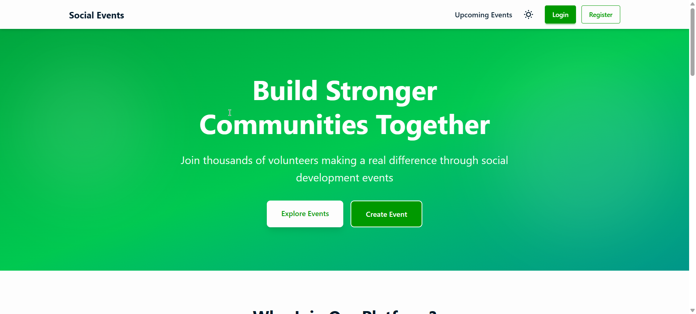

# CommunityEvents 🎉

A modern community-driven social events platform that allows users to create, manage, and join events seamlessly. Built with performance and clean UI in mind.

---

## 📸 Screenshot



---

## 🔗 Live Demo

🌐 **Live Site:**  
https://devcat-b12a10.netlify.app/

---

## ✨ Features

- 🔐 **User Authentication**
  - Secure email/password login
  - Google OAuth integration via Firebase

- 📅 **Event Creation & Management**
  - Create detailed community events
  - Edit or delete events you own
  - Manage event information easily

- 🔎 **Event Discovery**
  - Browse upcoming community events
  - Join events hosted by other users

- 🎨 **Modern UI & UX**
  - Fully responsive design
  - Dark / Light theme toggle
  - Clean and minimal interface

- ⚡ **Real-time Updates**
  - Instant event updates using Firebase
  - Live authentication state handling

---

## 🛠️ Technologies Used

### Frontend
- React
- Vite
- React Router

### Styling
- Tailwind CSS
- DaisyUI

### Backend & Services
- Firebase
- Firebase Authentication

---

## 📦 Dependencies

Key dependencies used in this project:

- react
- react-router-dom
- firebase
- tailwindcss
- daisyui

(See `package.json` for the full list)

---

## 🚀 Getting Started

Follow these steps to run the project locally:

```bash
# Clone the repository
git clone https://github.com/your-username/social-events-client.git

# Navigate to the project folder
cd social-events-client

# Install dependencies
npm install

# Start the development server
npm run dev
